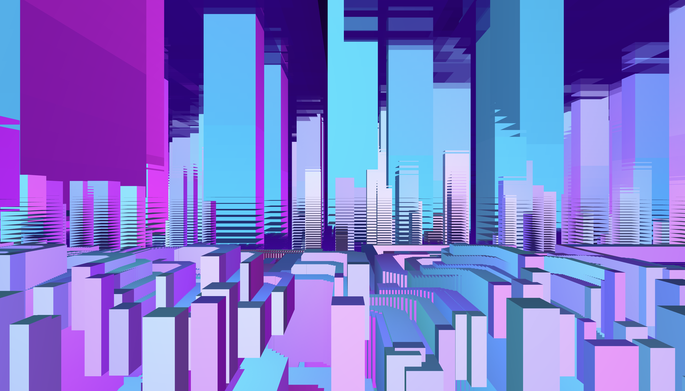

# Creative Coding #
This is a folder where my code is sleeping zzzzzz

# Day 1 - 2025-10-20 #

During the 1st day of the coding worksop, we were exploring P5js and the basic things that it contains such as drawing circles, how a circle trhough time can gradualy become bigger with 

circle(width * 0.5 , height * 0.5 , frameCount * 0.1);

I learned what is a setup function and the draw function

I learned what is an array in coding, experimented with that and created a canvas where different circles are gittering, reapearing wnd disapearing in a fast motion.

[Appearing and disapearing circles moving](http://127.0.0.1:5505/Code/2025-10-20/arrays/index.html)

Also I did an experiment where I generated a shape on a blank canvas fron strings and atributed a function where with my mouse I could sculpt it and reshape the strings.

**Before** 

**After**

[Modulating Shape](http://127.0.0.1:5505/Code/2025-10-20/Modules/index.html)

**Flying trhought city**

An experiment where the user spawns under the city,sees fictional cars flying that later destort based on your movement. The user can fly up, down, left, right with WASDZX keyboard letters. As the user moves, the city generates itself and most of the time it destorts and gives cool effects. 

[Cyberpunk City](http://127.0.0.1:5505/Code/2025-10-20/Ciberpunk%20citywith%20imaginary%20cars/index.html) 

Explanation of the code: 

- Movement through the map (world) using key binds WASDXZ; X and Z refers to up and down W is front, S is back, A is left, D is right
- Buildings are created randomly (random height, lenghth, and colour) in chunks around the camera
- cars fly through the city (something that does not work actualy hahahaha)
- Environment: Neon sky, glowing ground. Evrything in a cyberpunk style. 

- **Move Around**  
  I can fly around the city using the keyboard.  
  *How I did it:* `handleControls()` moves the camera.

- **Build the City**  
  I only create buildings near me so the game runs fast.  
  *How I did it:* `generateCity()` makes nearby buildings.

- **Glowing Buildings**  
  My buildings are colorful boxes that glow and change colors over time.  
  *How I did it:* `buildings` array and the `draw()` loop.

- **Flying Cars**  
  Cars fly around with lights and exhaust flames.  
  *How I did it:* `cars` array and the `draw()` loop.

- **Draw Everything**  
  I draw the sky, ground, buildings, and cars every frame.  
  *How I did it:* `setGradient()` for the sky and `draw()` loop for the rest.

# Day 2 - 2025-10-21 #

**Click on the screen, circles appear and move on their own axis**

[Clicking Circles](http://127.0.0.1:5505/Code/2025-10-20/Collection/index.html)

# Day 3 - 2025-10-23 #

**Hand Tracking**

On the third day, I was introduced to a tool called MediaPipe. It is a framework that can detect and track different body parts, such as hands, faces, and poses. After detection, the data can be used or manipulated for various applications. 

At the beginning of the day, I received a pre-prepared file containing code that tracks my hands using MediaPipe. When I ran the program, it displayed green lines connecting the joints of my hand and small circles around each finger, showing how the system detects and follows hand movements in real time.

This small base code whas the begining of my journey of exploring the tool that is mediapipe. 

In the mediapipe given fille there was mediapip.js files and a sketch file.. For all my experiments I modified only the sketch file in otder that the hand motion tracking remains intackt. 

**My experiments and creations**

*Shape rotation with fingers*

Interactive creation combining MediaPipe and Hand gesture recognition with animated shapes + obstacles. 

- My hands are being tracked with the use of a webcam. 
- There is a central shape that follows my index finger. 
- The shape rotates as my hands rotate, but also at the same time after several second is morthing into another shaoe. 
- Includes a launh animation when the center of the shape is touche (does not work smoothly)
- A bar of selecting a shape. 

Shape selection for start

Rotation of shape

**2nd version**

In the second version I removed the bar with the shape selection because the profesor said why to have it if I could only use a touch screen. 

Resize of the shape

Rotation of the shape

- **Camera**: I see a live webcam feed with a metallic effect.  
- **Hand detection**: My hands and fingers are tracked in real-time.  
- **Pinch (thumb + index)**: I can pick up shapes and move them smoothly.  
- **Fist detection**: I can create a copy of a shape.  
- **Hand position**: I can launch or kick shapes depending on where my hands are.  
- **Index finger touch**: I can delete shapes by tapping them.  
- **Physics**: Shapes move, bounce, and interact naturally with edges and each other.  
- **Responsive canvas**: The shapes and canvas adjust automatically if I resize the window.

---

 *Launching, cloning and deleting shapes + coloured background*

Here I created an experience where I can manipulate shapes with hand gestures. 

- DIfferent shapes float on the canvas. With the thumb and the index I can grab the shapes.
- With my fist closed I can duplicate shapes
- With having hands positioned in different corners I can launh circles from one jand to another 
- By moving my hands I can left and right I can kick circles into different positions. 
- With the help of my index finger I can touch shapes and delete them easily. 
- The sketch applies a subtle **metallic video background** effect and each shape has its own **color, size, and velocity**, with **basic physics** for movement and collisions at the edges.  

### 1. Different shapes float on the canvas. With my thumb and index I can grab the shapes.
- Lines: **62–78, 80–83**

---

### 2. With my fist closed I can duplicate shapes.
- Lines: **86–91**

---

### 3. With my hands in different corners I can launch circles from one hand to another.
- Lines: **94–103**

---

### 4. By moving my hands left or right I can kick circles into different positions.
- Lines: **96–99** (inside the open hand swipe code)

---

### 5. With the help of my index finger I can touch shapes and delete them easily.
- Lines: **106–112**

---

### 6. The sketch applies a subtle metallic video background effect.
- Lines: **22–41**

---

Deleting shape by touching it with the index finger

Launching shapes when hands are in different positions: left and right

---

**Interactive Techno Color Window with Hand Gestures** 

- live camera / webcam is converted into a grainy texture
- Hand gestures are being detected in real time with green conecting lines
- when the middle finger is open during a pinch action (closing of 2 fingers) resizes the coloured rectangle
- The rectangle blends with the background camera and changes it's colour each 2 seconds. 
- The coloured rectangle follows the hand when the fingers are pinched. The rectangle follows the index finger smoothly, allowing to drag it across the screen. (only when two fingers are pinched)
- The rectangle resizes by itself when the window size ischanged. 

---

- `setupVideo(true)` → turns on webcam in selfie mode.  
- `isVideoReady()` → checks if the camera is ready.  
- Loops through `videoElement.pixels` → creates **grainy black & white background**.  
- `detections.multiHandLandmarks` → gets hand positions for **gesture detection**.  
- Pinch logic → moves the rectangle smoothly using **index finger position**.  
- Middle finger distance → adjusts rectangle **width and height**.  
- `rectWindow.show()` → draws the **colored rectangle** with blending.  
- `windowResized()` → updates the **canvas and rectangle** when the window changes.  

---

**Create different shapes when fingers open, draw the with movment of hand + shapes fade out**

Here I experimented with creation of shapes when fingers open, drawing them and then they fade out after some time.

- **Chromatic Background:**  
  I see a moving rainbow-like pattern behind everything.  
  *(Lines 14–22)*

- **Red-Chrome Camera Layer:**  
  My webcam video shows up on top with a shiny red-metal effect.  
  *(Lines 24–40)*

- **Hand Detection:**  
  I can see my hand in the sketch. The program checks where my fingers are.  
  *(Lines 42–72)*

- **Add Shapes:**  
  When I open at least 3 fingers, a new shape appears at my hand.  
  *(Lines 80–85)*

- **Grab & Drag Shapes:**  
  I can pinch a shape with my thumb and index finger to move it around.  
  *(Lines 87–98)*

- **Delete Shapes:**  
  If I close my fist completely, all shapes disappear.  
  *(Lines 100–102)*

- **Shapes Rotate:**  
  Shapes slowly spin around themselves to look alive.  
  *(Lines 108–131 inside `Shape` class)*

- **Fade Out:**  
  Shapes slowly disappear after 1 second if I don’t interact with them.  
  *(Lines 104–106)*

---

# Day4 2025-10-23 #

Today was the final day of the workshop. I moved from the hand gestures to the facial expresions. The differecnce from day 3 was that now the code recognises my lips and both eyes wich means thechnicaly if I would either blink an eye or open my mouth I would triger a some sort of response. 

**Different experiment with facial expresions**

Shapes appear when mouth opens 

Mouth closed

Mouth open

- webcan and canvas:

`createCanvas(windowWidth, windowHeight)` → fills browser window.  
 `setupFace()` & `setupVideo(true)` → start MediaPipe face detection and webcam in selfie mode.  
Flipped webcam drawn using `translate(width, 0)` + `scale(-1, 1)`.

---

- face detection:

- `getFaceLandmarks()` → detects facial landmarks.  
- `getBlendshapeScore('eyeBlinkLeft'/'eyeBlinkRight')` → detects eye blink.  
- `getBlendshapeScore('jawOpen')` → detects mouth open.

---

- Triger shapes:

- **Open mouth** → spawns a **rectangle** at a random position. 

---

- Shape behavior: 

- `update()` → moves shapes up and fades them out.  
- `display()` → draws the shape as circle or rectangle.  
- Shapes removed when fully faded (`alpha <= 0`).

